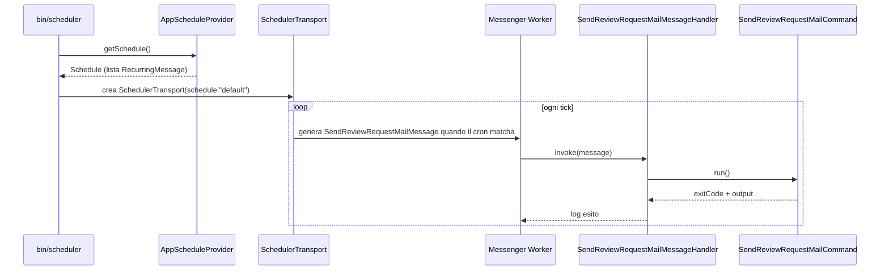

# Scheduler

Descrizione di come funziona il processo `bin/scheduler`, il daemon che esegue i job pianificati del progetto tramite Symfony Scheduler + Messenger.

## Panoramica

`bin/scheduler` è un processo long-running (daemon) che:

1. Legge la definizione degli orari da un `ScheduleProviderInterface` (`AppScheduleProvider`).
2. Trasforma ogni voce dello schedule in un messaggio Symfony Messenger, generato al momento giusto da un `MessageGenerator`/`SchedulerTransport`.
3. Consuma questi messaggi con un `Worker` Symfony Messenger, che li instrada verso l'handler registrato (`HandlersLocator`).
4. L'handler esegue il vero comando applicativo (es. `SendReviewRequestMailCommand`) e logga l'esito.

Il pacchetto `dragonmantank/cron-expression` è una dipendenza richiesta da `symfony/scheduler` per interpretare le espressioni cron (es. `0 0 * * *`) usate da `RecurringMessage::cron()`.

## Flusso di esecuzione



## Componenti principali

| File | Ruolo |
|---|---|
| [bin/scheduler](../bin/scheduler) | Entry point: monta bus, transport e worker, avvia il loop `$worker->run()`. |
| [src/Commands/Scheduler/AppScheduleProvider.php](../src/Commands/Scheduler/AppScheduleProvider.php) | Definisce lo schedule "default" (attributo `#[AsSchedule]`) e le regole cron (`RecurringMessage::cron(...)`). |
| [src/Commands/Scheduler/SendReviewRequestMailMessage.php](../src/Commands/Scheduler/SendReviewRequestMailMessage.php) | Messaggio Messenger "vuoto", usato solo come trigger. |
| [src/Commands/Scheduler/SendReviewRequestMailMessageHandler.php](../src/Commands/Scheduler/SendReviewRequestMailMessageHandler.php) | Handler (`#[AsMessageHandler]`) che esegue il comando console e logga esito/output. |
| [src/Commands/SendReviewRequestMailCommand.php](../src/Commands/SendReviewRequestMailCommand.php) | Comando Symfony Console `app:orders:send-review-request`: invia le mail di richiesta recensione. |
| [config/di/scheduler-di.php](../config/di/scheduler-di.php) | Registra nel container DI `AppScheduleProvider` e `SendReviewRequestMailMessageHandler`. |

## Job pianificati attualmente attivi

| Job | Espressione cron | Descrizione |
|---|---|---|
| `app:orders:send-review-request` | `0 0 * * *` (ogni giorno a mezzanotte, Europe/Rome) | Invia mail di richiesta recensione per gli ordini consegnati, evitando invii duplicati. |

## Come aggiungere un nuovo job pianificato

1. Creare una classe messaggio in `src/Commands/Scheduler/` (semplice DTO/marker, senza logica).
2. Creare l'handler corrispondente con l'attributo `#[AsMessageHandler]`, che richiama il comando/servizio applicativo desiderato.
3. Registrare l'handler in [config/di/scheduler-di.php](../config/di/scheduler-di.php).
4. Aggiungere la nuova regola in `AppScheduleProvider::getSchedule()` con `RecurringMessage::cron('<espressione>', new NuovoMessaggio())`.
5. Aggiungere il messaggio e l'handler nella `HandlersLocator` dentro `bin/scheduler`.

## Avvio ed esecuzione

Il processo va lanciato come daemon (dentro il container):

```bash
docker exec -it dolcezampa_webservice bash
php bin/scheduler
```

Rimane in esecuzione (`$worker->run()` è bloccante) finché non riceve un segnale di stop (es. `SIGTERM`). In produzione va gestito da un supervisor di processo (es. `supervisord`, systemd, o il gestore del container) per garantirne il riavvio automatico.

## Log

Ogni avvio e ogni esecuzione di job vengono loggati tramite la facade `Log` (Monolog):
- All'avvio: `Scheduler: avviato, schedule "default" in ascolto`.
- Ad ogni esecuzione: `Scheduler: eseguito app:orders:send-review-request` con `exitCode` e `output` del comando.

## Dipendenze

- `symfony/scheduler`: definizione degli schedule e generazione dei messaggi al momento giusto.
- `symfony/messenger`: bus e worker per consumare i messaggi generati.
- `dragonmantank/cron-expression`: parsing delle espressioni cron usate da `RecurringMessage::cron()`.
